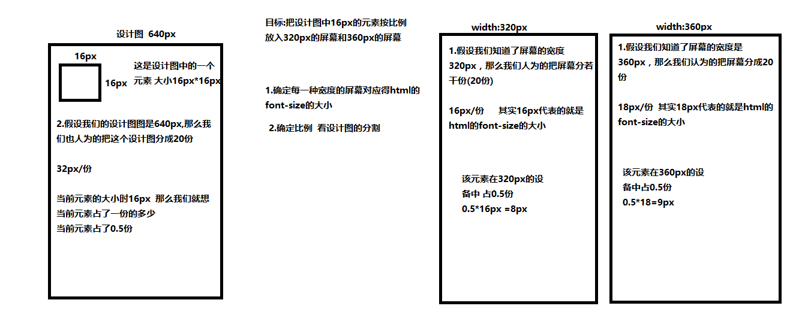

## less

  #### less介绍
  > less 是什么?

    less是一个CSS预处理器，可以为网站启用可自定义，可管理和可重用的样式表。 less是一种动态样式表语言，扩展了CSS的功能。
    CSS预处理器是一种脚本语言，可扩展CSS并将其编译为常规CSS语法，以便可以通过Web浏览器读取。 
    它提供诸如函数变量，， mixins 和操作等功能，可以构建动态CSS。本质上，LESS 包含一套自定义的语法及一个解析器。

  > 为什么要使用less?

    less轻松地生成可在浏览器中工作的CSS。(sass less stylus)
    less使您能够使用嵌套编写更干净，组织良好的代码。通过使用变量可以更快地实现维护。
    less使您能够通过在规则集中引用它们来轻松地重用整个类。
    less提供使用操作，使得编码更快并节省时间。

  #### less安装
  > 安装步骤:

    第一步: 安装node (node就是没有dom的javascript node是开发后台应用程序的)  node -v

    第二步: 在命令提示符下运行以下命令: npm(node package manage) install(安装) -g(global) less
            如果你看到了如下的结果
            `-- less@2.6.1
              +-- errno@0.1.4
              | `-- prr@0.0.0
              +-- graceful-fs@4.1.3
              +-- image-size@0.4.0
              +-- mime@1.3.4
              +-- mkdirp@0.5.1
              | `-- minimist@0.0.8
              +-- promise@7.1.1
              | `-- asap@2.0.3
              +-- request@2.69.0
              | +-- aws-sign2@0.6.0
              | +-- aws4@1.3.2
              | | `-- lru-cache@4.0.0
              | |   +-- pseudomap@1.0.2
              | |   `-- yallist@2.0.0
              | +-- bl@1.0.3
              | | `-- readable-stream@2.0.6
              | |   +-- core-util-is@1.0.2
              | |   +-- inherits@2.0.1
              | |   +-- isarray@1.0.0
              | |   +-- process-nextick-args@1.0.6
              | |   +-- string_decoder@0.10.31
              | |   `-- util-deprecate@1.0.2
              | +-- caseless@0.11.0
              | +-- combined-stream@1.0.5
              | | `-- delayed-stream@1.0.0
              | +-- extend@3.0.0
              | +-- forever-agent@0.6.1
              | +-- form-data@1.0.0-rc4
              | | `-- async@1.5.2
              | +-- har-validator@2.0.6
              | | +-- chalk@1.1.1
              | | | +-- ansi-styles@2.2.0
              | | | | `-- color-convert@1.0.0
              | | | +-- escape-string-regexp@1.0.5
              | | | +-- has-ansi@2.0.0
              | | | | `-- ansi-regex@2.0.0
              | | | +-- strip-ansi@3.0.1
              | | | `-- supports-color@2.0.0
              | | +-- commander@2.9.0
              | | | `-- graceful-readlink@1.0.1
              | | +-- is-my-json-valid@2.13.1
              | | | +-- generate-function@2.0.0
              | | | +-- generate-object-property@1.2.0
              | | | | `-- is-property@1.0.2
              | | | +-- jsonpointer@2.0.0
              | | | `-- xtend@4.0.1
              | | `-- pinkie-promise@2.0.0
              | |   `-- pinkie@2.0.4
              | +-- hawk@3.1.3
              | | +-- boom@2.10.1
              | | +-- cryptiles@2.0.5
              | | +-- hoek@2.16.3
              | | `-- sntp@1.0.9
              | +-- http-signature@1.1.1
              | | +-- assert-plus@0.2.0
              | | +-- jsprim@1.2.2
              | | | +-- extsprintf@1.0.2
              | | | +-- json-schema@0.2.2
              | | | `-- verror@1.3.6
              | | `-- sshpk@1.7.4
              | |   +-- asn1@0.2.3
              | |   +-- dashdash@1.13.0
              | |   | `-- assert-plus@1.0.0
              | |   +-- ecc-jsbn@0.1.1
              | |   +-- jodid25519@1.0.2
              | |   +-- jsbn@0.1.0
              | |   `-- tweetnacl@0.14.1
              | +-- is-typedarray@1.0.0
              | +-- isstream@0.1.2
              | +-- json-stringify-safe@5.0.1
              | +-- mime-types@2.1.10
              | | `-- mime-db@1.22.0
              | +-- node-uuid@1.4.7
              | +-- oauth-sign@0.8.1
              | +-- qs@6.0.2
              | +-- stringstream@0.0.5
              | +-- tough-cookie@2.2.2
              | `-- tunnel-agent@0.4.2
              `-- source-map@0.5.3
    第三步: 如果出现类似的上面的结果 代表less安装成功了。 用一个命令: lessc -v;

  #### less编译css

  > 第一种方法(**命令行**): 在less文件夹下打开命令行窗口 输入命令:**lessc path/xxx.less path/xxx.css**

  > 第二种方法(**webstorm**): 找到webstorm中的 文件(file)> 设置(setting) > 工具(Tools) > File Watchers对话框    中的'+'号  选择less  前提是必须安装node和less

  > 第三种方法(**vscode**): 在vscode中安装Easy Less 然后在文件中创建less文件即可

  > 第四种方法(*Koala*): 专门把less 编译成css的软件 (如果用koala软件 则不再需要使用安装less)

#### less语法
  > 变量

  格式: @变量名: 值

    body {
      background-color:#ccc;
    }
    
    main {
      color:#ccc;
      background-color:#fff;
      font-size:24px;
      padding:20px 30px 40px 50px;
    }
    aside {
      font-size:24px;
      margin:20px 30px 40px 50px;
    }

  > 嵌套规则

    .container h1 {
      font-size: 25px;
      color: #E45456;
    }
    
    .container p {
      font-size: 25px;
      color: #3C7949;
    }
    
    .container .myclass h1 {
      font-size: 25px;
      color: #E45456;
    }
    .container .myclass p {
      font-size: 25px;
      color: #3C7949;
    }

  > 父选择器

  格式: & 代表父选择器  > 代表直接子元素选择器
    a {
      color:yellowgreen;
    }
    a:link {  
      color: black;  
    }  
    a:visited {  
      color:blue;  
    }  
    a:hover {  
      color: orange;  
    }  
    a:active {  
      color: pink;  
    }  

  > 四则运算(+ - * /)

    .myclass {
      font-size: 20px;
      color: green;
    }

  > 注释

    // 没有注释的代码是不好的   // 静默注释

    /* 注释应当解释为什么 而不是 是什么。可以选择性的解释如何做 如果代码特别令人困惑的话*/

  > 混合器(无参 有参无默认值  有参有默认值)

  格式: .混合器的名字(参数) {}
    a {
      color:yellowgreen;
    }
    a:link {  
      color: black;  
    }  
    a:visited {  
      color:blue;  
    }  
    a:hover {  
      color: orange;  
    }  
    a:active {  
      color: pink;  
    }  

  > 继承(扩展)

  格式: &:extend(选择器)
    main {
      color:#ccc;
      background-color:#fff;
      font-size:24px;
      padding:20px 30px 40px 50px;
    }
    aside {
      font-size:24px;
      margin:20px 30px 40px 50px;
    }

  > 导入其他less文件

   @import "src"   单一职责原则
---------------------------------------------------------------
## 什么是媒体查询
  - 媒体查询是CSS3的中一个强大的工具。它是包含媒体类型以及零或多个检查特定媒体特征条件的表达式。
    表达式描述了媒体特征, 最终会被解析为 true 或 false.如果是true 那么会执行  如果是false 就不会执行了.
    要做响应式(媒体查询)  还要做rem布局(需要用到媒体查询)
    通过不同的判别条件识别不同的设备 以给该设备应用不同的样式
## 如何使用媒体查询
  - link标签中的CSS媒体查询
    用link方式引入的时候 media属性中 放着媒体查询的条件  如果条件成立 那么应用该样式表
    <link rel="stylesheet" href="./link-ipone5.css" media="screen and (width: 320px)">
  - 样式表中的@media关键字引入CSS媒体查询
      @media 条件 {
        在该条件成立的时候 应用的样式
      }
## 媒体特性
  - width 视口的宽度
  - height 视口的高度
  - device-width 设备屏幕宽度
  - device-height 设备屏幕高度
  - orientation 横屏竖屏 
    - portrait （纵向）
    - landscape（横向）

## 如何解决媒体查询的兼容性问题
  Respond.js 是一个极小的增强 Web 浏览器的 JavaScript 库，使得原本不支持 CSS 媒体查询的浏览器能够支持它们。该脚本循环遍历页面上的所有 CSS 引用，并使用媒体查询分析 CSS 规则。然后，该脚本会监控浏览器宽度变化，添加或删除与 CSS 中媒体查询匹配的样式。最终结果是，能够在原本不支持的浏览器上运行媒体查询。

## rem布局(移动端主流)

  #### 相对单位rem和em

  > em

    em是一个相对长度单位。当使用em单位时，像素值将是em值乘以使用em单位的元素的字体大小。(如果使用em单位的元素没有直观的font-size,那么就在计算样式中查找)

  > rem

    rem也是一个相对长度单位。只不过r(root)em它相对的不再是自己的font-size.当使用 rem 单位，他们转化为像素大小取决于页面根元素的字体大小，即 html 元素的字体大小。根元素字体大小乘以你 rem 值。

  #### rem布局原理

  

  #### 

